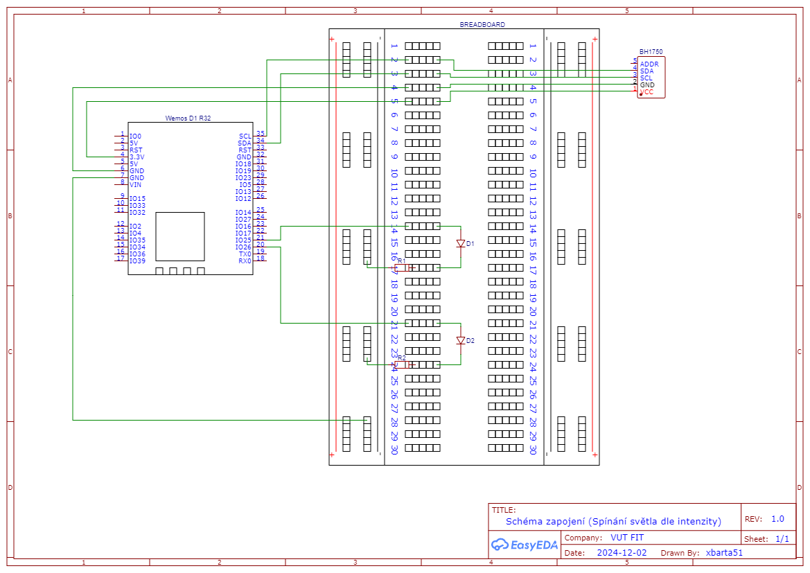

# Spínání světla dle intenzity
## Dokumentace k projektu
**Autor:** Tomáš Barták  
**Datum:** 02. 12. 2024

## Úvod
Cílem tohoto projektu je měřit intenzitu světla pomocí senzoru, a následně na základě aktuálně naměřených hodnot intenzity okolního světla, nastavovat úroveň svitu LED diod. Takový systém může simulovat, jak fungují některá světla v chytrých domácnostech, pouličním osvětlení a podobně. Zároveň uživatel může navíc sledovat naměřené hodnoty, případně v průběhu upravovat hodnoty, kdy se mají LED diody spínat, maximální hodnoty intenzity, při které se má nastavit svit LED diody na maximum a podobně. Veškerá správa probíhá v reálném čase pomocí MQTT protokolu. Tyto upravené hodnoty jsou současně ukládány na NVS modul, což je energeticky nezávislá paměť, takže nastavení zůstane na zařízení uloženo i po odpojení napájení.

Následující kapitoly budou zaměřené na představení technického návrhu řešení, hardwarovou i softwarovou implementaci, funkcionalitu samotného systému včetně dostupných uživatelských nastavení.

## Návrh řešení a realizace

Systém se z pohledu hardwaru skládá ze senzoru BH1750, který slouží k měření intenzity světla. Další nepostradatelnou částí je samotná deska Wemos D1 R32 s mikrokontrolérem ESP32, která zajišťuje mnoho nezbytných úloh jako zpracovávání samotných dat, komunikaci s MQTT brokerem pro vzdálené nastavování zvolených parametrů systému.

### Popis schématu
Zapojení celého systému je poměrně přímočaré, jednotlivé piny senzoru pro snímání intenzity světla jsou spojeny přes Breadboard s danými piny na desce Wemos D1 R32, tedy daný SDA pin senzoru s daným pinem na desce, pin SCL s pinem SCL na desce, pin senzoru GND je spojen s pinem na desce pro zem (GND) a nakonec také pin VCC je spojen s pinem na desce označeným jako 3V3, tedy zdroj napětí o 3,3V.

Zbytek schématu je věnován zapojením jednotlivých LED diod, kde zdroj napětí je veden z desky z pinu GPIO25 pro jednu z diod (ve schématu označena jako D1) a pro druhou (D2) je vedena z desky z pinu GPIO26. Zdroje napětí z těchto pinů desky jsou navedeny na anody LED diod a za katodou LED diod se vždy nachází rezistor, který je doveden do spoje na zem na Breadboardu, který je následně sveden do pinu určeného pro zem na desce (GND).

### Senzor BH1750
Tento senzor je ideální pro získávání dat intenzity okolního světla, a to v rozsahu 1-65535 lux. Je vhodný například pro upravování svitu LCD panelů nebo také pro úpravu podsvícení klávesnice tlačítkových telefonů. Senzor komunikuje přes I²C sběrnici, který slouží pro komunikaci mezi mikrokontroléry a dalšími periferiemi.

### Deska Wemos D1 R32
Tato deska obsahuje čip ESP32, pod jehož názvem se skrývá řada mikrokontrolérů vyvíjených společností Espressif. Tyto moduly s ESP32 zahrnují různé bezdrátové funkce. Procesor této desky dokáže zpracovávat jednotlivé instrukce s frekvencí až 240 Mhz a až 600 DMIPS a obsahuje dvě jádra. Jedno jádro je dedikované bezdrátovým funkcím, zatímco druhé jádro je rezervované pro uživatelskou aplikaci. Zároveň deska obsahuje 4 MB SPI Flash, 448 KB ROM a 520 KB SRAM paměť. Bezdrátově může komunikovat s ostatními zařízeními pomocí zabudovaného WiFi a Bluetooth modulu. Pro nahrání samotného systému na desku lze využít spojení pomocí Micro USB kabelu.

## Implementace
Celý projekt byl implementován v jazyce *Arduino*, který je jakousi variantou programovacího jazyka *C++*, práce probíhala v aplikaci Visual Studio Code pod jeho rozšířením zvaném *PlatformIO*, které umožňuje jednoduše projekt založit, nahrávat do systému aktualizovaný kód, či případné sledování výpisů pro vyhledávání chyb či sledování očekávaného chodu programu s pomocnými výpisy. Tato kapitola bude zaměřená na implementaci zajímavých částí systému.

### Linearizace
Linearizace úrovně svitu LED diod je nezbytná, protože lidské vnímání intenzity světla není lineární. To však jde vynahradit právě linearizací jasnosti LED diod, která byla zpracována ve funkci `gammaLinearization`. Jak je z názvu funkce jasné, zvolil jsem pro linearizaci techniku gamma korekce, díky které je možné se výrazně přiblížit tomu, aby nám připadalo, že se svit LED diod zvedá plynule. Jako gammu jsem zvolil hodnotu 2.2, která je doporučena například ve článku. Výsledný vzorec pro převod procentních hodnot x úrovně svitu LED na její linearizované hodnoty (opět v procentech) je následující:

correctedX = (x / 100)^2.2 * 100

### Plynulé přechody úrovní svitu
Plynulé přechody jsou zajištěny funkcí `brightnessFade`, která zároveň zajišťuje čekání mezi měřeními v hlavním cyklu programu. Funkce zjistí ideální počet kroků, ve kterém by se přechod měl provést. Tento počet kroků je závislý na rozdílu mezi aktuální a požadovanou hodnotou. Následně se provádí cyklus, do doby, než se dosáhne požadované úrovně svitu LED diod.

### Připojování k MQTT brokeru
Pro komunikaci uživatele se zařízením je nutné založit spojení mezi samotným zařízením a serverem, který slouží ke komunikaci s daným zařízením prostřednictvím MQTT protokolu. Tento protokol slouží ke komunikaci mezi klientem a serverem, s možností zprávy buď publikovat nebo odebírat. Celý protokol je vytvářený, aby byl jednoduše implementovatelný pro použití v komunikaci mezi stroji "Machine to Machine" nebo "Internet of Things".

Samotná funkce `connectMqtt` je pak vcelku jednoduchá, obsahuje cyklus, který čeká než se naváže spojení se serverem. V případě, že se spojení navázat nepovede, vypíše dané chybové hlášky a po 5 sekundách zkouší znovu. Pokud je však spojení navázáno úspěšně, pak vypíše hlášení, že zařízení bylo připojeno a začne odebírat konkrétní témata (topic), na kterých zařízení očekává nějaké zprávy pro změnu nastavení, například změnu prahových hodnot nebo režim svitu. Následně dá zařízení uživateli vědět, že došlo k úspěšnému spojení se serverem pomocí problikání LED diod třikrát po sobě.

### Zpracování jednotlivých zpráv
Každá zpráva, která dorazí na zařízení je zpracována tzv. "callback" funkcí, která se nazývá `mqttCallback`. Tato funkce má tedy za úkol jednotlivé zprávy rozpoznat a náležitě na ně zareagovat. Funkce tedy prvně zkontroluje, jakého tématu se daná zpráva týká. Aktuálně jsou podporovaná dvě příchozí témata, a to *light/threshold* a *config/direction*.

Při zprávě příchozí k tématu light/thresholds program očekává obsah zprávy, kde budou dvě hodnoty. Těmi hodnotami je minimální prahová hodnota pro úroveň svitu *newMinLux* a maximální prahová hodnota pro úroveň svitu *newMaxLux*. Program tedy převede řetězec ze zprávy na číselné hodnoty, následně tyto hodnoty validuje, aby nenastal případ, že nějaká z hodnot je záporná, případně jestli maximální hodnota není menší než minimální. V případě, že žádná chyba nenastane, pak se hodnoty uloží, aplikují se pro aktuálně běžící program a odešle se zpět na server zpětná vazba, že se podařilo změnit hodnoty. V opačném případě se posílá na server zpráva o neúspěchu.

U zpráv přicházejících na config/direction se opět kontroluje obsah zprávy, tentokrát se však porovnává přímo s řetězci, podle kterých se nastavuje, zda-li mají LED diody svítit při nízké intenzitě svitu nebo naopak. Opět se posílá zpětná vazba, která informuje uživatele, zda-li vše proběhlo v pořádku a nebo vznikla nějaká chyba v systému.

### NVS funkce
Pro NVS existuje v projektu více funkcí, tahle podkapitola bude sloužit jako přehled k nim.

Funkce jako `saveLightThresholds` a `saveConfig` slouží, jak už název napovídá, k ukládání prahových hodnot a nastavení zařízení do stálé paměti. Před uložením se zkontroluje, zda jde otevřít konkrétní namespace v paměti v režimu pro čtení a zápis a následně hodnoty uloží do paměti.

Dále funkce jako `loadLightThresholds` a `loadConfig` naopak slouží k získání těchto hodnot z paměti. Opět proběhne kontrola, zda jde otevřít daný namespace, ale tentokrát pouze v režimu pro čtení a následně se hodnota uloží do proměnné. Funkce `loadAllData` slouží pouze pro jednodušší volání, aby nebylo potřeba volat obě funkce.

### Inicializace a nastavení WiFi modulu
Funkce `setupWifi` se stará o inicializaci a správné připojení k WiFi, po úspěšném připojení LED diody třikrát zablikají.

### Inicializace programu
Ta probíhá ve funkci `setup`, kde se inicializují věci jako sériová komunikace, I²C komunikace, senzor pro měření intenzity osvětlení, načítají se data ze stálé paměti (NVS), inicializují se LED diody, připojení k WiFi a serveru pro komunikaci přes MQTT včetně nastavení "callback" funkce.

### Hlavní tělo programu
To se nachází ve funkce `loop`, kde se tohle tělo opakuje stále dokola. Součástí tohoto cyklu je například samotné měření intenzity okolního světla, výpočet pro svit LED diod, podle něj je spočítána střída, která ovlivňuje postupné rozsvícení, či stmívání diod a také cyklus obsahuje odesílání aktuální naměřené hodnoty intenzity okolního světla každých 5 sekund na MQTT server.

## Funkcionalita a vlastnosti řešení
Systém v základním nastavení odesílá naměřené hodnoty intenzity okolního světla na server, který zpracovává MQTT zprávy a zároveň podle těchto hodnot upravuje míru jasu LED diod. Zároveň jsou na server odesílány zprávy jako zpětné vazby u některých úkonů. Například při změně hladina prahových hodnot zařízení na server odešle zprávu o jejím úspěchu, či neúspěchu a podobně.

Kromě základního chování lze aplikaci ovládat přes MQTT broker, kde uživatel může měnit nastavení jako horní prahovou hodnotu (tedy maximální hodnotu lux, kde LED dioda svítí na 100% úrovně jasu), případně i spodní prahovou hodnotu, která systému udává, od jaké hranice se má LED dioda sepnout. Tohohle nastavení lze dosáhnout odesláním zprávy na téma (topic) light/thresholds ve tvaru minLux, maxLux, kde minLux znázorňuje hodnotu minimální a maxLux znázorňuje hodnotu maximální prahové hodnoty pro LED diody.

Dalším uživatelským nastavení je režim, ve kterém systém pracuje. Tento režim se dá měnit pomocí odesláním zprávy na téma config/direction. Tato zpráva má očekávané vstupní řetězce, a to *night*, *day* a *swap*. Režim night může reflektovat nastavení například pouličního osvětlení, respektive v tomto režimu se systém chová tak, že čím menší hodnoty intenzity okolního světla senzor zachytává, tím vyšší je jas LED diod. Dalším nastavením je režim day, který má opačný efekt a může simulovat chování například LED displeje, kde čím vyšší je intenzity okolního světla, tím vyšší hodnotu jasu musí mít jednotlivé LED diody. Posledním nastavením je swap, který je zaveden pro jednodušší ovládání a není potřeba znát aktuální stav, ve kterém se systém momentálně nachází. V případě, že se systém nachází v režimu day, tak jej přepne do režimu night a naopak.